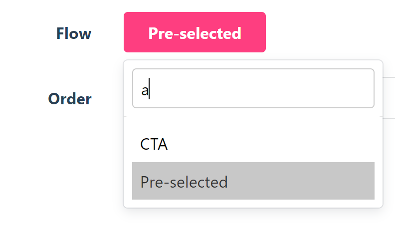

# Administrate::Field::LazyBelongsTo

[](https://travis-ci.com/XPBytes/administrate-field-lazy_belongs_to)
[](https://badge.fury.io/rb/administrate-field-lazy_belongs_to)
[](http://opensource.org/licenses/MIT)

An input field that shows search results of an association, lazily.



## Installation

Add this line to your application's Gemfile:

```ruby
gem 'administrate-field-lazy_belongs_to'
```

And then execute:

    $ bundle

Or install it yourself as:

    $ gem install administrate-field-lazy_belongs_to

## Usage

This field needs a bit of setup, unless you're using [XPBytes/administrate-base_controller](https://github.com/XPBytes/administrate-base_controller),
in order to lazily collect the values you're looking for:

You need to have a route that yields an array of objects with at least the value and label you want to show. The best
way is to re-use everything administrate offers you, which is the default behaviour of `Administrate::BaseController`:

```ruby
class BookController < Admin::ApplicationController
  def index
    respond_to do |format|
      format.json do
        resources = Administrate::Search.new(scoped_resource, dashboard_class, params[:search].to_s.strip).run
        resources = apply_resource_includes(resources)
        resources = order.apply(resources)
        resources = resources.page(params[:page]).per(records_per_page)

        render json: resources
      end

      format.any { super }
    end
  end
end
```

This way, your already existing route also is available in JSON. You may optimize this by only use the id and value
field: `resources.to_json(fields: %i[id name])`.

The rest of the setup is as easy as any other field, except that you need to tell the field where to query the results,
which key it should use for the value (defaults to `id`) and the label (defaults to `name`).

```ruby
require "administrate/base_dashboard"

class BookDashboard < Administrate::BaseDashboard
  # ATTRIBUTE_TYPES
  # a hash that describes the type of each of the model's fields.
  #
  # Each different type represents an Administrate::Field object,
  # which determines how the attribute is displayed
  # on pages throughout the dashboard.
  ATTRIBUTE_TYPES = {
    id: Field::String,
    name: Field::String,
    author: Field::LazyBelongsTo.with_options(
      placeholder: 'Select the author',
      action: ->(field, q:) { field.url_helpers.admin_publisher_books_path(field.resource.publisher, search: q) },
      value_attribute: :id,
      label_attribute: :name
    ),
    created_at: Field::DateTime,
    updated_at: Field::DateTime
  }.freeze
  
  # ...
end
```

You get the `field` and the search template `q` as argument and named argument. By default this is `{q}` which is
replaced with the actual query on the front-end. You can use the `field.resource` shortcut to scope the url; in this
example above it will only show authors with the current publisher.

### Options

| option | type | default | description |
|--------|------|---------|-------------|
| `placeholder` | `string` | `'Select a %<associated_class>s'` | The button text if there is no current value |
| `action` | `lambda -> (field, q: string)` |  | The path to get the associated |
| `value_attribute` | `string` or `symbol` | `id` | The attribute that you want to store in the field (`association_id`) |
| `label_attribute` | `string` or `symbol` | `name` | The attribute that you want to show to the user (label) | 
| `size` | `number` | `10` | The number of results to show at most (the rest will scroll) |

## Related

- [`Administrate`](https://github.com/thoughtbot/administrate): A Rails engine that helps you put together a super-flexible admin dashboard.
- [`Administrate::BaseController`](https://github.com/XPBytes/administrate-base_controller): :stars: A set of application controller improvements.

### Concerns

- [`Administrate::DefaultOrder`](https://github.com/XPBytes/administrate-default_order): :1234: Sets the default order for a resource in a administrate controller.
- [`Administrate::SerializedFields`](https://github.com/XPBytes/administrate-serialized_fields): :ab: Automatically deserialize administrate fields on form submit.

### Fields

- [`Administrate::Field::Code`](https://github.com/XPBytes/administrate-field-code): :pencil: A `text` field that shows code.
- [`Administrate::Field::Hyperlink`](https://github.com/XPBytes/administrate-field-hyperlink): :pencil: A `string` field that is shows a hyperlink.
- [`Adminisrtate::Field::JsonEditor`](https://github.com/XPBytes/administrate-field-json_editor): :pencil: A `text` field that shows a [JSON editor](https://github.com/josdejong/jsoneditor).
- [`Administrate::Field::ScopedBelongsTo`](https://github.com/XPBytes/administrate-field-scoped_belongs_to): :pencil: A `belongs_to` field that yields itself to the scope `lambda`.
- [`Administrate::Field::ScopedHasMany`](https://github.com/XPBytes/administrate-field-scoped_has_many): :pencil: A `has_many` field that yields itself to the scope `lambda`.
- [`Administrate::Field::TimeAgo`](https://github.com/XPBytes/administrate-field-time_ago): :pencil: A `date_time` field that shows its data as `time_ago` since.

## Development

After checking out the repo, run `bin/setup` to install dependencies. Then, run `rake test` to run the tests. You can
also run `bin/console` for an interactive prompt that will allow you to experiment.

To install this gem onto your local machine, run `bundle exec rake install`. To release a new version, update the
version number in `version.rb`, and then run `bundle exec rake release`, which will create a git tag for the version,
push git commits and tags, and push the `.gem` file to [rubygems.org](https://rubygems.org).

## Contributing

Bug reports and pull requests are welcome on GitHub at [XPBytes/administrate-field-lazy_belongs_to](https://github.com/XPBytes/administrate-field-lazy_belongs_to).
